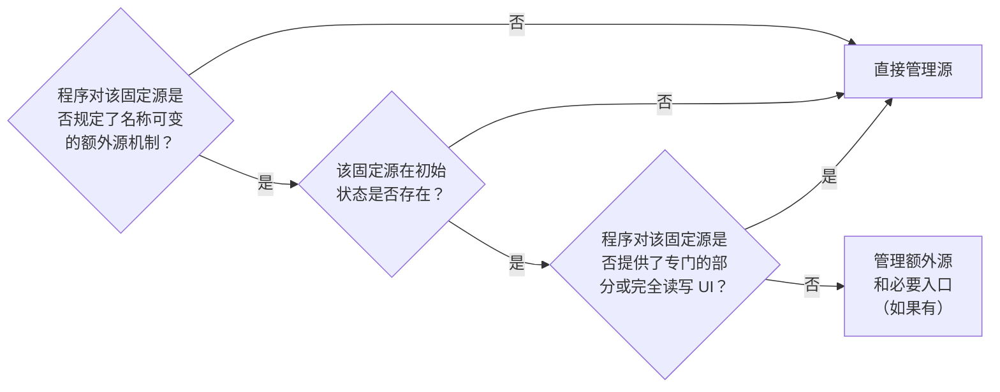

# 配置管理

`cfg` 是由 `git` 进行版本管理的个人配置库，其工作假设是机器的软件环境（发行版 `cachyos`、桌面 `hyprland`、软件包）一致，同时对不同的软件环境和硬件环境保有稳健性。`cfg` 通常以 `bare repo` 的形式存放在 `$HOME/.cfg`，工作树为 `$HOME`；在 `fish` 中通过名为 `cfg` 的函数快捷访问，相当于 `git --git-dir=$HOME/.cfg --work-tree=$HOME`。由于工作树范围较大，`cfg` 通常采用白名单管理。

利用 `cfg` 管理配置文件时有如下决策和偏好：

- 程序在识别非默认配置时，通常规定了名称固定的单个或多个配置源，在初始状态（全新安装或不做更改的首次运行后，包括发行版出厂配置）它们可能存在或不存在；部分程序还规定了名称可变的，对固定源进行补充的额外源机制（如 `drop-in` 或指定了自定义内容的位置或低侵入 `include/require/source` 的方式）；程序通过不同的规则择取或合成这些源成为运行时配置；对于这些源，部分程序提供了专门的读写 UI （读写 UI 指除了会修改源以外，还会读取来反馈变更），这些 UI 可能只对某个源的一部分进行读写；当我们需要判断某个固定源该如何纳入 `cfg` 管理时，有[决策树（附表A）](#附表a决策树)做出了如下选择：

  **直接管理源**

  - `.config/kitty/kitty.conf` 由 `kitten choose-fonts` `kitten theme` 管理
  - `.config/fcitx5/conf/classicui.conf` 由 `fcitx5-configtool` 管理
  - `.config/juhradial/config.json` 由 `juhradial-settings` 管理
  - `.config/fish/functions/*.fish` 由 `funced` `funcsave` 管理
  - `.config/hypr/{hyprlock.conf|hypridle.conf}` 初始状态不存在
  - `.config/mimeapps.list` 由 `kcmshell6 kcm_filetypes` 管理
  - `.local/state/noctalia/settings.toml` 由 `noctalia` 管理
  - `.config/syncthingtray.ini` 由 `syncthingtray-qt6` 管理
  - `.config/hypr/hyprland-gui.lua` 由 `hyprmod` 管理
  - `.config/zellij/layouts/*.kdl` 由 `zellij` 管理
  - `.config/fastfetch/config.jsonc` 没有额外源
  - `.config/newsboat/urls` 没有额外源

  **管理额外源和必要入口（如果有）**

  - `.config/hypr/hyprland.lua` 没有读写 UI 且可由 `require("hyprland-custom")` 低侵入添加额外源
  - `.config/uwsm/env` 没有读写 UI 且可由 `.config/uwsm/env.d/*` 零侵入添加额外源
  - `.local/share/fcitx5/rime/rime_ice.schema.yaml` 没有读写 UI 且可由 `rime_ice.custom.yaml` 零侵入添加额外源

- 配套资源的放置尊重惯例，但这种惯例最好是来自于开发者的。大部分情况都采用就近放置。

文件到位后，按软件要求重新加载、部署或重启，使配置生效。在大部分情况下，`cfg` 希望无需额外初始化，但有少数情况下，例如超出 `cfg` 的管辖范围，又或是出于控制仓库体积、复用上游提供的安装脚本等考虑，在首次部署时需要通过可选脚本来初始化 `cfg` 的工作环境（添加包仓库、安装包、调整防火墙、添加预设包、设置 `plymouth` 动画等等）。

利用 `cfg` 管理用户脚本项目时有如下偏好：

- 用户自行维护、无需编译的脚本项目，通常与配套资源集中放置在 `.local/share/<项目名>/`，各自维护 Git 忽略规则；命令入口可通过软链接放在 `.local/bin/`。这是出于项目灵活性的考虑。

## 附表A：决策树

## 附表B：配置机制

以下记录 2026-10-05 本机安装版本的实测结果。测试使用临时 HOME、XDG 目录及独立 D-Bus 会话；用标记值核对加载结果，用文件访问跟踪核对读取和写入位置。软件包归属通过 `pacman -Qo` 核对。表中没有列出的机制不代表程序不支持；「未读取测试片段」只描述该次测试，不等同于穷举所有扩展方式。

`$XDG_CONFIG_HOME`、`$XDG_DATA_HOME`、`$XDG_STATE_HOME` 未设置时，通常分别对应 `~/.config`、`~/.local/share`、`~/.local/state`。下表记录实测中的变量路径和固定路径。「内置默认值」指没有外部配置文件时仍能得到的值；Python 默认字典、包内示例文件和运行时生成文件另行说明。

| 程序（实测版本） | 配置识别位置 | 引入、分片及合成机制 | 默认内容与文件生成 |
| --- | --- | --- | --- |
| JuhRadial Qt 设置界面（0.4.5-beta.3） | 设置后端读取 `$XDG_CONFIG_HOME/juhradial/config.json`。 | JSON 与随程序安装的 Python `DEFAULT_CONFIG` 递归合并：只写 `pointer.speed` 时，仍保留默认的 `pointer.acceleration`。测试中的 `include` JSON 键、同目录 `extra.json` 和 `config.d/a.json` 没有引发额外文件读取。 | 默认内容在 `/usr/share/juhradial/settings-qt/bridge/backend.py` 的字典中。空目录调用 `_load()` 不创建 JSON；调用 `_save()` 才写入。Qt UI 离屏首次打开、等待 4 秒且不操作时未创建该 JSON，但创建了 autostart 文件。另用全新目录复测：默认 `app.start_at_login=true` 且已安装启动器时，不点击开关也会补建 autostart；预设为 `false` 时不会创建。安装过程本身是否创建该文件尚未实测。本机这份 Python 文件没有 pacman 包归属。 |
| Syncthing Tray（2.1.6） | 常规路径为 `$XDG_CONFIG_HOME/syncthingtray.ini`；读取后端也能从 `$XDG_CONFIG_DIRS/syncthingtray.ini` 取得设置。实际程序还探测当前目录及可执行文件目录的 `syncthingtray.ini`；设置 `SYNCTHINGTRAY_CONFIG_DIR` 后读取该目录下的同名文件。 | 用户与系统文件同时设置 `tray/showTraffic` 时，用户值生效。测试中的 `include=extra.ini` 和 `syncthingtray.ini.d/10-probe.ini` 未加载。 | 空配置调用程序库的 `Settings::restore()` 得到 `showTraffic=true`，不生成 INI；`Settings::save()` 创建用户 INI，重新读取能得到保存的值。离屏首次打开窗口、等待 4 秒且不操作时未创建 INI；补测单独实例化真实 `QtGui::SettingsDialog` 并点击启用的 Apply 按钮后仍未生成 INI；这条独立对话框路径没有复现完整托盘程序的保存流程，后者仍未验证。 |
| Fcitx5 classicui（5.1.23） | 依次查找 `$XDG_CONFIG_HOME/fcitx5/conf/classicui.conf`、`$XDG_CONFIG_DIRS/fcitx5/conf/classicui.conf`、`/etc/xdg/fcitx5/conf/classicui.conf`。`/usr/share/fcitx5/addon/classicui.conf` 是同时会读取的插件描述文件。 | 找到用户配置后未继续读取系统同名文件：用户文件只设 Font 时，Theme 使用内置 `default`，没有继承测试系统文件的 Theme。测试中的 `include` 键、`extra.conf` 和 `classicui.conf.d/a.conf` 未加载。 | 无配置文件时，运行中的插件通过 D-Bus `GetConfig` 返回 Font=`Sans 10`、Theme=`default` 等默认值；这些值不是从 `conf/classicui.conf` 读取的。`SetConfig` 实测创建用户配置并保存 Font。单独离屏打开 configtool、等待 4 秒未生成 classicui 配置；保存测试走的是服务端配置接口。 |
| fastfetch（2.69.0） | 无参启动按搜索路径寻找 `fastfetch/config.jsonc`，包括 `$XDG_CONFIG_HOME`、账号 HOME 的 `.config`、`$XDG_CONFIG_DIRS`、`/etc/xdg`、`/etc`；本机 `--list-config-paths` 可列出候选目录。 | 用户与系统文件同时存在时只使用用户文件。仅放置 `config.json` 或 `extra.jsonc` 不会像 `config.jsonc` 一样自动加载；在 JSON 中加入 `include` 键也未读取目标文件。 | 隔离账号 HOME、所有候选 `config.jsonc` 均不存在时，程序仍输出默认模块，未生成配置文件。显式执行 `--gen-config <文件>` 会生成 JSONC。仅改环境变量 HOME 不足以隔离此程序：本次跟踪曾看到它继续读取账号数据库中的 HOME 路径。 |
| Newsboat（2.45） | 已有 `$XDG_CONFIG_HOME/newsboat/` 时读取其中的 `config`、`urls`；测试中它与 `~/.newsboat/` 并存时使用前者。只有旧目录时读取 `~/.newsboat/urls`；两个目录均无配置时，本次错误提示指向 `~/.newsboat/urls`。 | `config` 中的 `include /绝对路径` 会读取该文件，所含非法指令会报错。同样的语句放进 `urls` 后，`newsboat -e` 导出的订阅地址是字面量 `include`，没有读取目标 URL 文件。 | 空目录执行 `-e` 报没有订阅地址，未生成 `urls`。补测实际终端交互启动：空目录仍报没有订阅地址，不生成 `urls`；预置一条订阅后进入列表并按 q 正常退出，没有生成 `config`。未验证其他选项默认值的存储位置。 |
| hyprlock（0.9.6）、hypridle（0.1.8） | 两者分别查找 `hypr/hyprlock.conf`、`hypr/hypridle.conf`，顺序为 `$XDG_CONFIG_HOME`、`~/.config`、`$XDG_CONFIG_DIRS`、`/etc/xdg`。 | 在主文件中写 `source = /绝对路径`，两者都实际打开了目标文件。 | 空目录启动均报缺少配置，没有生成用户配置。各自的软件包提供 `/usr/share/hypr/hyprlock.conf`、`/usr/share/hypr/hypridle.conf`，本次默认查找未读取或复制这些示例。加载测试停在无法连接隔离的 Wayland 显示；未测试锁屏、空闲动作或所有选项的内置默认值。 |
| uwsm（0.27.0） | 实际环境加载器 `/usr/lib/uwsm/prepare-env.sh` 从 `$XDG_DATA_DIRS`、`$XDG_CONFIG_DIRS`、`$XDG_CONFIG_HOME` 的层级读取 `uwsm/` 下的环境文件。本次每类目录各放一个标记，执行顺序为数据目录 → 系统配置目录 → 用户配置目录。 | 每层先执行 `env`，再执行 `env.d/*`；Hyprland 测试还随后执行 `env-hyprland`、`env-hyprland.d/*`。`10-a` 先于 `20-b`，`.disabled` 片段被跳过；文件中的 POSIX shell `. /路径` 实际执行。后一次赋值覆盖前值，也可以显式追加。 | 加载器在没有用户环境文件时不要求先生成模板。补测启用 profile 的加载器：在隔离挂载的 `/etc/profile`、临时 `~/.profile`、`uwsm/env`、`env-hyprland` 中的标记依次执行。加载实际 `hyprland.sh` 插件后，桌面名从 `Probe` 变为 `Probe:Hyprland`，等待变量加入 `HYPRLAND_INSTANCE_SIGNATURE`。未测试完整会话启动。 |
| Fcitx5 Rime（5.1.16）／librime（1.17.0） | Fcitx5 的 Rime 配置接口返回用户数据目录 `$XDG_DATA_HOME/fcitx5/rime`；运行时跟踪看到共享目录 `/usr/share/rime-data`，以及用户目录中的 YAML 和 `build/` 路径。 | 用本机 `rime_ice.schema.yaml`（版本字段 `2026-03-08`）及其 YAML 依赖实际部署：`rime_ice.custom.yaml` 的 `patch` 将 `schema/name` 改为测试值，结果进入 `build/rime_ice.schema.yaml`；源文件中的 `__include` 引用也在部署产物中展开。 | `/usr/share/rime-data/default.yaml` 由本机 `rime-prelude` 包提供。本机用户目录的 `rime_ice.schema.yaml` 没有 pacman 包归属。此次部署由 librime 的 `deploy_config_file` 读取方案 YAML 并生成 `build/` 产物；补测空用户目录运行 `rime_deployer --build <用户目录> /usr/share/rime-data <用户目录>/build` 成功，生成 `user.yaml`、`build/default.yaml` 及本机共享目录已有方案的构建产物，没有出现 `rime_ice` 文件。此项验证部署器使用已安装的共享数据，不涵盖第三方安装脚本或 Fcitx5 GUI 首次启用流程。 |
| Hyprland（0.56.2） | 查找 `hypr/hyprland.lua`，再查找旧格式 `hypr/hyprland.conf`；每轮探测 `$XDG_CONFIG_HOME`、`~/.config`、`$XDG_CONFIG_DIRS`、`/etc/xdg`。 | `require("probe")` 实际执行配置目录的 `probe.lua`；`dofile("/绝对路径")` 也实际执行目标 Lua 文件，测试均用文件内抛出的标记错误确认。 | 空目录执行 `--verify-config` 就会生成 `$XDG_CONFIG_HOME/hypr/hyprland.lua`。这次生成没有读取 `/usr/share/hypr/hyprland.lua`，生成内容与该包内示例也不相同。软件包确实另带该示例；本次没有启动完整桌面。 |
| fish（4.9.3） | 实际读取用户 `fish/conf.d/*.fish`、包提供的 `vendor_conf.d/*.fish`、`/etc/fish/config.fish` 和 `$XDG_CONFIG_HOME/fish/config.fish`。函数从 `$fish_function_path` 查找，本次包含用户 `fish/functions`、`/etc/fish/functions` 和各 data 目录的 `vendor_functions.d`。 | 用户 `conf.d/10-a.fish`、`20-b.fish`、`config.fish` 中的标记按此顺序执行；`source /路径` 执行额外文件。调用函数时自动加载对应的 `functions/<函数名>.fish`。 | 本机 `/etc/fish/config.fish` 由 fish 包提供。空用户目录运行 `fish -i -c exit` 后生成了用户 `config.fish` 和 `fish_variables`。`funcsave saved_probe` 实测写入用户 `functions/saved_probe.fish`。这些是本机带已安装 vendor 配置的运行结果，没有将所有生成行为归因于纯上游 fish。 |
| Zellij（0.45.1） | `setup --check` 列出 `~/.config/zellij`、`$XDG_CONFIG_HOME/zellij`、`/etc/zellij`，查找目录内的 `config.kdl`；测试中前两个位置不同且同时存在时，使用 `~/.config/zellij`。 | `default_layout "probe"` 实际加载选中配置目录下的 `layouts/probe.kdl` 并启动该布局。向配置写入 `include "…/extra.kdl"` 后，`setup --check` 没有打开该文件。 | 无用户配置时 `setup --dump-config` 可导出内置默认配置，其完整文本也在本机 Zellij 可执行文件中逐字匹配到；`setup --check` 不生成文件。在 XDG 配置目录采用通常的 `~/.config` 路径时，实际首次终端启动在输入向导选项前已生成 `zellij/config.kdl`；按 Enter 后再次写入，并留下 `.bak`。未测试布局编辑 UI 的保存流程。 |
| MIME 关联／KDE KService（6.30.0） | 通过实际 `KApplicationTrader::preferredService("text/plain")` 验证：系统 `$XDG_CONFIG_DIRS/mimeapps.list`、用户 `$XDG_CONFIG_HOME/mimeapps.list`、用户 `kde-mimeapps.list` 均参与读取；在 `XDG_CURRENT_DESKTOP=KDE` 的同一 MIME 默认应用测试中，优先级依次升高。 | `.desktop` 应用声明与 `mimeapps.list` 的默认应用关联共同参与查找。本次在用户 data 目录创建三个应用声明并重建 KService 缓存，分别验证三个关联文件中的标记；补测同一目录下 `extra.list`、`custom-mimeapps.list`、`mimeapps.list.d/10-extra.list`，以及主文件 `[General]` 内的 `include=extra.list`：均未触发片段读取，查询仍返回主文件中的默认应用。 | `KApplicationTrader::setPreferredService` 实测写入用户 `mimeapps.list` 的 `Default Applications` 和 `Added Associations`。离屏打开 `kcmshell6 kcm_filetypes`、等待 4 秒且不操作时未生成该文件。保存测试调用的是 KService API，没有将它表述为点击 KCM 保存。 |
| hyprmod（0.4.0） | 后端识别 `$XDG_CONFIG_HOME/hypr/hyprland.lua`；默认管理文件实测固定为 `~/.config/hypr/hyprland-gui.lua`，两处在非默认 XDG 路径下可能不在同一目录。 | 通常目录下运行实际 `setup.run_setup()` 会创建管理文件，并向入口追加 `require("hyprland-gui")`。入口被重定位而管理文件仍在通常目录时，本次追加的是绝对路径 `dofile(...)`。`config.write_all()` 写出的 `hl.config` 设置可被其读取后端读回。 | 测试从手工提供的最小 `hyprland.lua` 开始，setup 创建 `hyprland-gui.lua`，保存后端写入设置。未测试缺少入口时的首次 GUI 初始化，也未将这些后端调用等同于打开 UI 自动生成。 |
| Noctalia（5.2.1） | `config export` 实际读取 `$XDG_CONFIG_HOME/noctalia/` 顶层 TOML，再读取 `$XDG_STATE_HOME/noctalia/settings.toml`。 | `10-a.toml` 与 `20-b.toml` 按文件顺序合并，后者的同名标量覆盖前者，其他键保留；状态文件的同名值再覆盖配置目录。测试中的 `.conf` 文件和子目录内的 TOML 未读取。本次测试未设置引入这些顶层 TOML 的主文件。 | 空目录 `config export full` 导出含默认值的完整 TOML，`config export merged` 为空，且两者都没有生成用户配置或 `settings.toml`。此次验证的是程序提供的同一配置栈导出接口；首次打开 shell/UI 及交互修改时的写盘时机未测。 |
| kitty（0.49.2） | 实际默认选项加载器先读取 `/etc/xdg/kitty/kitty.conf`，再读取用户 `$XDG_CONFIG_HOME/kitty/kitty.conf`；`KITTY_CONFIG_DIRECTORY` 可重定位用户配置目录。 | `include custom.conf` 加载相对主文件目录的文件；`globinclude conf.d/*.conf` 加载测试中的 `10-a.conf`、`20-b.conf`，同名标量以后值为准。主文件在 include 后再次赋值也会覆盖子文件；系统文件中未被用户覆盖的值保留。仅放置 `custom.conf` 不会自动读取。 | 空目录的原生选项加载器返回 `font_size=11`、`background_opacity=1`，与安装的 `kitty/options/types.py` 中的 Python 默认值一致，未创建 `kitty.conf`。实际运行 `kitten themes` 选择临时主题后，生成 `current-theme.conf`，并在 `kitty.conf` 的 `BEGIN_KITTY_THEME` 块内加入 include。补测「编辑配置」动作调用的 `prepare_config_file_for_editing()`：缺失时生成用户 `kitty.conf`；已有标记配置时保留原内容。此项调用实际准备函数，没有启动编辑器窗口；`choose-fonts` 交互保存仍未测。 |

测试入口说明：CLI 项使用程序本身及其配置检查、导出命令；uwsm 使用安装的 `prepare-env.sh`；JuhRadial、hyprmod、kitty 的解析测试调用安装包中的实际 Python 后端；Syncthing Tray 和 MIME 关联分别链接本机 `libsyncthingwidgets-qt6`、`libKF6Service` 调用其读写 API；Fcitx5 使用独立进程的 D-Bus `GetConfig`／`SetConfig`；Rime 使用本机 librime 部署器。离屏 UI 测试只证明所注明的启动观察，不能代替未完成的交互保存测试。
